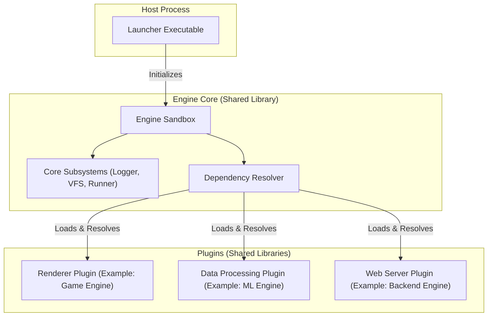

<div align="center">

# 🧱 Sandbox Meta-Engine

**Sandbox is an experimental, C++23 plugin-oriented multipurpose engine infrastructure currently in development.**

[]()
[]()
[](LICENSE.txt)

</div>

---

## Why Sandbox?

Most engines bake their subsystems in at compile time, tightly coupling logic to a specific use case. Sandbox takes a different approach. It provides a generic, highly moddable infrastructure where every feature is a **Plugin** loaded at runtime from a shared library (`.dll` / `.so` / `.dylib`). 

Think of it like building with LEGO bricks. Sandbox manages the boring, complex parts of engine development (like dependency resolution, event routing, and virtual filesystems), letting you focus purely on the fun part: creating features. 

We hope to foster a community-driven ecosystem. Developers can create complex, specialized plugins and share them with everyone. Because Sandbox enforces strict, decoupled guidelines and includes a built-in versioning system, plugins are highly compatible. For example, you could mix Person A's advanced Unreal 5-grade Path-Traced Renderer with Person B's highly deterministic Rollback Netcode, and Person C's ML-driven NPC logic. Just drop all three DLLs into the same folder. Sandbox will automatically resolve their dependencies, seamlessly wire their event streams together across the ECS, and orchestrate the entire boot sequence without you having to write a single line of C++ integration glue.

---

## Key Features

- **Automatic Dependency & Version Resolution** - Plugins declare what they need and what version they are, and the engine handles the loading order automatically to ensure compatibility.
- **Virtual Filesystem (VFS)** - Built on [PhysFS](https://icculus.org/physfs/), every file access goes through a unified `mount://` protocol. Archives (`.zip`), directories, and writable cache paths are all first-class mounts.
- **ECS-native Architecture** - Powered by [Flecs](https://www.flecs.dev/), subsystem Services are singleton ECS components. Any module anywhere in the engine can query `ecs.get<renderer_service>()` without including a single engine header.
- **Decoupled Event Bus** - Modules communicate via typed events (`events::filesystem::read_request`, `events::log`, `events::runner::state_change`) published through the ECS.
- **Environment-driven Configuration** - The engine is initialized with a `std::unordered_map<std::string, std::any>` config map. No hard-coded flags, no config structs per subsystem.

---

## Quick Start

> **Note:** This Quick Start is intended strictly for testing the current engine build.

### Prerequisites

- CMake ≥ 3.20
- A C++23-capable compiler (MSVC, GCC 13+, Clang 16+)
- Git

### 1. Clone & Configure

```bash
git clone https://github.com/jehud/sandbox.git
cd sandbox
cmake -B cmake-build-debug -DCMAKE_BUILD_TYPE=Debug
```

### 2. Build

**Windows (MSVC)**
```cmd
cmake --build cmake-build-debug --target launcher --config Debug
```

**Linux / macOS**
```bash
cmake --build cmake-build-debug --target launcher -j$(nproc)
```

This produces three outputs in the `bin` directory:
| Output | Description |
|---|---|
| `sandbox` (`.exe` on Windows) | The runtime launcher |
| `libsandbox` (`.dll` / `.so` / `.dylib`) | The engine shared library |
| `modules/libtest_lib` (`.dll` / `.so` / `.dylib`) | An example plugin |

### 3. Run

> Replace `your_app.zip` or `your_app/` with the path to your own mounted application or folder containing a `manifest.json`.

**Windows**
```cmd
cd cmake-build-debug\bin
sandbox.exe --mount path\to\your_app.zip --dev
```

**Linux / macOS**
```bash
cd cmake-build-debug/bin
./sandbox --mount path/to/your_app/ --dev
```

The `--dev` flag sets the logger to `trace` level. The `--mount` flag specifies the application archive or directory you want to run. Use `--run` to enter the main loop immediately after boot.

---

## Architectural Overview



### Moddability Examples

Sandbox is an extremely customizable infrastructure. To build a specific type of engine, you only need to provide the right plugins:
- **Game Engine**: Combine a Vulkan Graphics plugin, a Jolt Physics plugin, and a FMOD Audio plugin. 
- **Data Processing Engine**: Combine a Big Data Loader plugin, a Parallel Processing plugin, and a Visualization plugin.
- **Backend Web Engine**: Combine an HTTP Server plugin, a Database connector plugin, and an Auth module plugin.

The core infrastructure handles the plumbing, meaning you can swap out the Path-Traced Graphics plugin for a lightweight mobile DirectX one without rewriting your logic, as long as both follow the shared interface guidelines.

## Repository Structure

```
sandbox/
├── sandbox/                 # Engine library
│   ├── include/sandbox/     # Public API headers
│   │   ├── core/            # Bootstrapper, Engine, Plugin macro definitions
│   │   ├── event_bus/       # Typed event structures and routing
│   │   ├── subsystems/      # Logger, VFS, Runner interfaces
│   │   └── utilities/       # Properties, config helper, and loader
│   └── source/              # Engine implementation
│       ├── core/            # Core system logic
│       ├── subsystems/      # Core subsystems implementations
│       └── utilities/       # Utility implementations
├── launcher/                # Host executable
│   └── source/main.cpp      # Bootstraps the engine
├── tests/                   # Professional Catch2 (v3) test suite
│   ├── unit/                # Core and subsystem unit tests
│   └── integration/         # Plugin loader and full bootstrapper tests
├── libtest/                 # Example plugin
│   ├── source/library.cpp   # Demo plugin implementation
│   └── assets/test-app.zip  # Manifest + packaged assets
└── docs/                    # Extended documentation
```

---

## License

Copyright © 2026 Jehud. Released under the [MIT License](LICENSE.txt).
