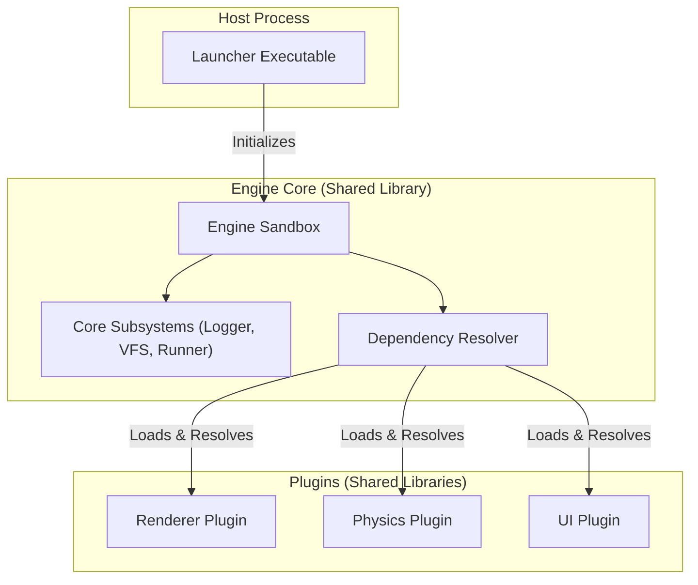

<div align="center">

# 🧱 Sandbox Meta-Engine

**Sandbox is an experimental, C++23 plugin-oriented game engine runtime currently in development.**

[]()
[]()
[](LICENSE.txt)

</div>

---

## Why Sandbox?

Most engines bake their subsystems in at compile time. Sandbox does not. Every feature — logging, rendering, physics, audio — is a **Plugin** loaded at runtime from a shared library (`.dll` / `.so` / `.dylib`). 

---

## Key Features

- **Automatic Dependency Resolution** — Plugins declare what they need, and the engine handles the loading order.
- **Virtual Filesystem (VFS)** — Built on [PhysFS](https://icculus.org/physfs/), every file access goes through a unified `mount://` protocol. Archives (`.zip`), directories, and writable cache paths are all first-class mounts.
- **ECS-native Architecture** — Powered by [Flecs](https://www.flecs.dev/), subsystem Services are singleton ECS components. Any module anywhere in the engine can query `ecs.get<renderer_service>()` without including a single engine header.
- **Decoupled Event Bus** — Modules communicate via typed events (`events::filesystem::read_request`, `events::log`, `events::runner::state_change`) published through the ECS.
- **Environment-driven Configuration** — The engine is initialized with a `std::unordered_map<std::string, std::any>` config map. No hard-coded flags, no config structs per subsystem.

---

## Quick Start

> **Note:** This Quick Start is intended strictly for testing the current engine build.

### Prerequisites

- CMake ≥ 3.20
- A C++23-capable compiler (MSVC, GCC 13+, Clang 16+)
- Git

### 1 — Clone & Configure

```bash
git clone https://github.com/jehud/sandbox.git
cd sandbox
cmake -B cmake-build-debug -DCMAKE_BUILD_TYPE=Debug
```

### 2 — Build

**Windows (MSVC)**
```cmd
cmake --build cmake-build-debug --target launcher --config Debug
```

**Linux / macOS**
```bash
cmake --build cmake-build-debug --target launcher -j$(nproc)
```

This produces three outputs in the `bin` directory:
| Output | Description |
|---|---|
| `sandbox` (`.exe` on Windows) | The runtime launcher |
| `libsandbox` (`.dll` / `.so` / `.dylib`) | The engine shared library |
| `modules/libtest_lib` (`.dll` / `.so` / `.dylib`) | The example plugin |

### 3 — Run

**Windows**
```cmd
cd cmake-build-debug\bin
sandbox.exe --mount ..\..\libtest\assets\test-app.zip --dev
```

**Linux / macOS**
```bash
cd cmake-build-debug/bin
./sandbox --mount ../../libtest/assets/test-app.zip --dev
```

The `--dev` flag sets the logger to `trace` level. The `--mount` flag specifies the application archive or directory. Use `--run` to enter the main loop immediately after boot.

---

## Architectural Overview



---

## Repository Structure

```
sandbox/
├── sandbox/                 # Engine library
│   ├── include/sandbox/     # Public API headers
│   └── source/              # Engine implementation
├── launcher/                # Host executable
│   └── source/main.cpp
├── libtest/                 # Example plugin
│   ├── source/library.cpp
│   └── assets/test-app.zip  # Manifest + packaged assets
└── docs/                    # Extended documentation
```

---

## License

Copyright © 2026 Jehud. Released under the [MIT License](LICENSE.txt).
