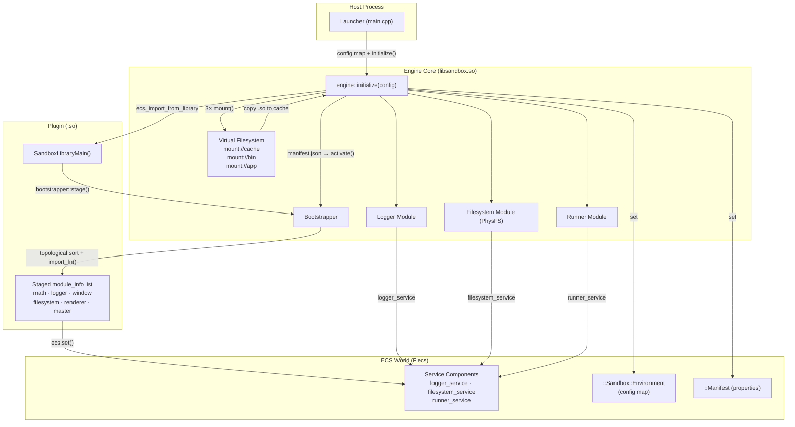

<div align="center">

# 🧱 Sandbox Meta-Engine

**A data-driven, plugin-oriented C++23 game engine runtime.**  
Sandbox provides a zero-coupling foundation for building modular applications where every subsystem — from the renderer to the physics solver — is a hot-swappable, dependency-resolved plugin.

[]()
[]()
[](LICENSE.txt)

</div>

---

## Why Sandbox?

Most engines bake their subsystems in at compile time. Sandbox does not. Every feature — logging, rendering, physics, audio — is a **Plugin** loaded at runtime from a `.so` / `.dll`. The engine's **Bootstrapper** automatically resolves the full dependency graph before importing a single module, making it impossible to load a renderer before its window system, or a window before its logger.

The result is an engine that is architecturally honest: coupling lives in the manifest, not in the source code.

---

## Key Features

- **Topological Dependency Bootstrapper** — Modules declare `require` constraints on other modules or named Services. The Bootstrapper resolves the full graph in multi-pass topological order, detecting deadlocks before they occur.
- **Virtual Filesystem (VFS)** — Built on [PhysFS](https://icculus.org/physfs/), every file access goes through a unified `mount://` protocol. Archives (`.zip`), directories, and writable cache paths are all first-class mounts.
- **ECS-native Architecture** — Powered by [Flecs](https://www.flecs.dev/), subsystem Services are singleton ECS components. Any module anywhere in the engine can query `ecs.get<renderer_service>()` without including a single engine header.
- **Decoupled Event Bus** — Modules communicate via typed events (`events::filesystem::read_request`, `events::log`, `events::runner::state_change`) published through the ECS, not through direct function calls.
- **Environment-driven Configuration** — The engine is initialized with a `std::unordered_map<std::string, std::any>` config map. No hard-coded flags, no config structs per subsystem.
- **ABI-safe Plugin Loading** — Plugins are standard shared libraries exporting a single C-linkage entry point (`SandboxLibraryMain`). The engine locates, copies to writable cache, and imports them at runtime via Flecs' `ecs_import_from_library` mechanism.
- **Strong Exception Safety Guarantee** — All engine state transitions either complete fully or leave the system unchanged. No silent partial-initialization states.

---

## Quick Start

### Prerequisites

- CMake ≥ 3.20
- A C++23-capable compiler (GCC 13+, Clang 16+)
- Git

### 1 — Clone & Configure

```bash
git clone https://github.com/jehud/sandbox.git
cd sandbox
cmake -B cmake-build-debug -DCMAKE_BUILD_TYPE=Debug
```

### 2 — Build

```bash
cmake --build cmake-build-debug --target launcher -j$(nproc)
```

This produces three outputs in `cmake-build-debug/bin/`:
| Output | Description |
|---|---|
| `libsandbox.so` | The engine shared library |
| `modules/libtest_lib.so` | The example plugin |
| `sandbox` | The runtime launcher |

### 3 — Run

```bash
cd cmake-build-debug/bin
./sandbox --mount /path/to/test-app.zip --dev
```

The `--dev` flag sets the logger to `trace` level. The `--mount` flag specifies the application archive or directory. Use `--run` to enter the main loop immediately after boot.

Expected output:
```
[info] [Logger] Boot logger mounted. Awaiting manifest...
[info] [Filesystem] Subsystem operational.
[info] [Engine] VFS mounts ready (cache, bin, app).
[info] [Engine] Module cache built.
[info] [Engine] Manifest loaded.
[info] [Bootstrapper] Loaded module: test_math
[info] [Bootstrapper] Loaded module: test_logger
[info] [Bootstrapper] Loaded module: test_window
[info] [Bootstrapper] Loaded module: test_filesystem
[info] [Bootstrapper] Loaded module: test_renderer
[info] [Bootstrapper] Loaded module: test_master
[info] [Bootstrapper] All activated modules loaded.
[info] [Logger] Shutting down.
```

---

## Architectural Overview



The initialization sequence is strictly linear and exception-safe:

1. The host calls `configure_plugin_os_api()` before constructing the engine.
2. `engine::initialize(config)` stores the config, imports core infrastructure (Logger, Filesystem, Runner), mounts the VFS, and discovers modules.
3. The Bootstrapper stages all `.so` modules, activates manifest-requested entries, resolves the dependency graph, and imports modules in topological order.
4. `engine::finalize()` (or the destructor) signals the Runner and resets the ECS world.

---

## Repository Structure

```
sandbox/
├── sandbox/                 # Engine library (libsandbox.so)
│   ├── include/sandbox/     # Public API headers
│   │   ├── core/            # engine.h, bootstrapper.h, plugin.h, module_info.h
│   │   ├── event_bus/       # Event types + publish/subscribe API
│   │   ├── subsystems/      # ilogger.h, irunner.h, ifilesystem.h
│   │   └── utilities/       # properties.h, filesystem.h, config_helper.h
│   └── source/              # Engine implementation (not part of public API)
├── launcher/                # Host executable
│   └── source/main.cpp
├── libtest/                 # Example plugin
│   ├── source/library.cpp
│   └── assets/test-app.zip  # Manifest + packaged assets
└── docs/                    # Extended documentation
```

---

## License

Copyright © 2026 Jehud. Released under the [MIT License](LICENSE.txt).

---

## Contributing

1. Fork the repository and create a feature branch from `main`.
2. Adhere to the coding standards documented in [WIKI.md](WIKI.md) (naming conventions, RAII, exception safety).
3. Ensure a clean build with zero warnings before submitting a pull request.
4. Include a test plugin demonstrating any new engine API surface.
5. Update [WIKI.md](WIKI.md) for any public API changes.
