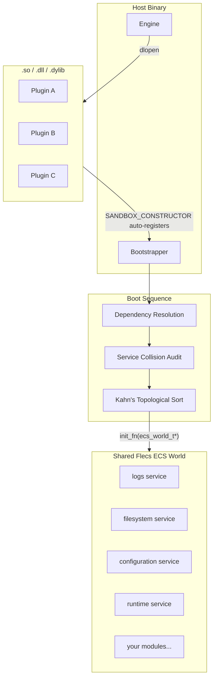

# Sandbox Engine


**A C++23 meta-engine where the host binary is intentionally empty.**

Sandbox is a minimal runtime that delegates all logic — core systems, business rules, domain behavior — to dynamically loaded C-ABI plugins resolved at startup via a topological dependency graph. The engine does not know what it is running. That is the point.

The same host binary can power a game, a financial simulation, a network server, a desktop application, or a security analysis tool. What runs is determined entirely by which modules are dropped into the application package — with no recompilation of the host.

> **Primary use case:** You want to build extensible, modular software where behavior can be composed, replaced, or extended at deployment time without touching the host binary.

Sandbox users build:
- Game engines and real-time simulations
- Modular server and microservice runtimes
- Desktop and tooling applications with hot-swappable subsystems
- Research and scientific simulation pipelines
- Developer toolchains with pluggable stages

---

## How It Works



When a plugin shared library is loaded, its modules register themselves automatically via compiler constructor hooks — no manual registration required. The bootstrapper then resolves the full dependency graph, audits for service conflicts, and initializes every module in the correct topological order. Circular dependencies are detected before any initialization code runs.

---

## Key Technical Features

**Topological Bootstrapper (Kahn's Algorithm)**
Modules declare what they need (required or optional) by name and minimum version. The bootstrapper walks the full dependency graph, pulls in missing providers, resolves conflicts, and produces a guaranteed valid initialization order using Kahn's BFS. A dependency cycle is a hard boot error.

**C-ABI Boundary**
No C++ types, no exceptions, and no RTTI cross plugin boundaries. Every subsystem API is a C struct of function pointers. Every resource is a uniquely typed opaque handle — passing the wrong handle type is a compile-time error. Plugins compiled against different compilers, standard libraries, or language toolchains can all coexist safely.

**Shared ECS World**
Flecs is statically linked into the host and re-exported via `-rdynamic`. Every loaded plugin resolves Flecs symbols from the host's own memory segment. There is one ECS world, one scheduler, one component ID namespace — shared across all modules, regardless of when or how they were loaded.

**Semantic Version Resolution**
Dependencies are declared with a name, architecture namespace, and minimum version. Patch version is optional — `-1` selects the highest available. An older plugin declaring `logs@1.0` continues working when the host ships `logs@1.3`. No recompilation. No glue code.

**Two-Layer API: C ABI and C++ SDK**
Every subsystem ships two interface layers:
- **C ABI** — `extern "C"` headers usable from any language with a C FFI: Zig, Rust, Python, Go, and more. Additional language SDKs are planned.
- **C++ SDK** — header-only wrappers over the C ABI with RAII, templates, and `std::format`-based logging.

The ABI is the contract. The SDK is convenience.

**Virtual Filesystem (VFS)**
URI-scheme mount points (`app://`, `cache://`, `save://`) backed by either physical directories or `.zip` archives. Reads from a zip archive and reads from a directory are identical at the call site — miniz handles decompression transparently.

**Format-Agnostic Property System**
Runtime configuration via a property tree that reads and writes JSON, BEVE, TOML, and YAML (backed by glaze). Accessible through both the C ABI and the C++ SDK.

**In-Memory Plugin Loading**
Plugins can be loaded from a raw memory buffer (e.g., after reading from the VFS). The loader checks the on-disk cache for a byte-identical existing file before writing, using UUID v4 filenames to avoid collisions.

---

## The Launcher

`sandbox_launcher` is a **separate project** built on top of the engine library. It is a reference implementation of a host that runs packaged applications.

### Application Package Format

```
my_application/
├── configuration.json      # Merged into engine properties at startup
└── plugins/
    ├── my_module.so        # Linux
    ├── my_module.dll       # Windows
    └── my_module.dylib     # macOS
```

Drop compiled native plugins into `plugins/`. The launcher discovers and loads the correct binary for the current platform automatically. Distributing all three variants makes a package fully cross-platform without any directory layout changes.

This is similar to a managed runtime — the host provides services, the package provides behavior — except the plugins are compiled native binaries, not bytecode.

### Virtual Mounts

The launcher configures three standard mounts through the engine's VFS:

| Virtual Path | Physical Location |
|---|---|
| `app://` | Application directory or `.zip` archive (from CLI argument) |
| `cache://` | `<OS temp>/SandboxEngine/plugin_cache` |
| `save://` | `<OS user data>/SandboxEngine/saves` |

These mounts are a **launcher convention**, not an engine constraint. A custom host binary can configure any mount layout.

### CLI Reference

```
sandbox_launcher <app_path> [options]

  app_path          Path to an application directory or .zip archive (required)
  --dev             Disable read-only on app://, enable developer tooling
  --logs <level>    Set log level: trace | debug | info | warn | error
```

### `configuration.json`

```json
{
  "logs": {
    "level": "info",
    "console": { "enabled": true },
    "file": { "path": "save://engine.log", "rotating": true, "max_size": 5242880 },
    "async": { "enabled": true, "queue_size": 8192 }
  }
}
```

All fields are optional. The engine applies safe defaults for anything not specified.

---

## Building

### Prerequisites

| | Minimum |
|---|---|
| CMake | 3.20 |
| Compiler | GCC 13+, Clang 17+, or MSVC 19.38+ (C++23 required) |
| Network | Required at configure time — dependencies fetched via `FetchContent` |

### Compile

```bash
git clone <repository-url>
cd sandbox
cmake -B build -DCMAKE_BUILD_TYPE=Release
cmake --build build -j$(nproc)
```

Output in `build/bin/`:

| File | Description |
|---|---|
| `sandbox_launcher` | Reference launcher |
| `sandbox_plugin.so` | Core module bundle (configuration, logs, filesystem, runtime) |
| `sandbox_unit_tests` | Unit test suite |
| `sandbox_suite_tests` | Integration scenario suite |

### Test

```bash
cd build/bin
./sandbox_unit_tests --order lex
./sandbox_suite_tests
```

### Run

```bash
./build/bin/sandbox_launcher path/to/my_application --logs info
./build/bin/sandbox_launcher path/to/my_application --dev --logs trace
```

---

## Writing a Module

A module is a shared library. Include the ABI headers, implement a Flecs module class, and call `SANDBOX_DECLARE_MODULE`. The rest is handled by the bootstrapper.

```cpp
// MyGameSystem.cpp
#include <sandbox/abi/bootstrapper.h>
#include <sandbox/sdk/logs.hpp>

struct MyGameSystem {
    MyGameSystem(flecs::world& ecs) {
        ecs.system<>("MyGameSystem")
           .run([](flecs::iter&) { /* per-tick logic */ });

        sandbox::modules::logs::info(ecs, "MyGameSystem initialized");
    }
};

static sandbox_requirement_info_t MyRequirements[] = {
    { SANDBOX_REQUIREMENT_KIND_SERVICE, SANDBOX_REQUIREMENT_STRICTNESS_REQUIRED,
      "logs",       "sandbox", 1, 0, -1 },
    { SANDBOX_REQUIREMENT_KIND_SERVICE, SANDBOX_REQUIREMENT_STRICTNESS_REQUIRED,
      "filesystem", "sandbox", 1, 0, -1 },
};

SANDBOX_DECLARE_MODULE(MyGameSystem, {
    .name              = "my-game-system",
    .description       = "Core game logic",
    .architecture      = "mygame",
    .version_major     = 1,
    .version_minor     = 0,
    .version_patch     = 0,
    .service           = nullptr,
    .requirements      = MyRequirements,
    .requirement_count = 2
})
```

Compile to a shared library, place it in `app://plugins/`, and the launcher handles the rest.

For documentation on services, the C ABI, language bindings, and advanced usage, see the project wiki *(work in progress)*.

---

## Known Limitations

### Plugin Security

Sandbox is designed to be domain-agnostic in the strongest sense. A security scanning plugin may need kernel access. A physics simulation may need unrestricted threading. A storage plugin may need direct filesystem access. Imposing a uniform permission boundary would disqualify entire categories of legitimate use.

The current consequence is that a loaded plugin holds the same OS permissions as the host process. The VFS mount system is a structural convention — a plugin that calls native OS file or network functions directly is not restricted from doing so by the engine.

This is a meaningful surface in a model where third-party plugins are distributed and loaded without prior inspection. The problem is recognized; no mitigation is currently implemented. Approaches under consideration:

- **Import table analysis** — scan plugin binaries for suspicious symbol imports before loading (heuristic, not a guarantee)
- **Permission manifests** — require plugins to declare capabilities in their module info; surface these to the operator before loading
- **Process-level isolation** — execute untrusted plugins in a sandboxed subprocess using seccomp (Linux) or AppContainer (Windows), with IPC back to the host

Each approach involves real tradeoffs against the generality requirement. For applications running fully trusted, in-house plugins, the current model is practical and sufficient.

---

## Dependencies

| Library | Version | Role |
|---|---|---|
| [Flecs](https://github.com/SanderMertens/flecs) | v4.1.4 | ECS world, component storage, system scheduling |
| [glaze](https://github.com/stephenberry/glaze) | v7.8.1 | JSON / BEVE / TOML / YAML serialization |
| [spdlog](https://github.com/gabime/spdlog) | 1.15.3 | Structured logging, async mode, rotating file sinks |
| [miniz](https://github.com/richgel999/miniz) | bundled | In-process `.zip` extraction for the VFS |
| [dylib](https://github.com/martin-olivier/dylib) | v3.0.1 | Cross-platform `dlopen` / `LoadLibrary` abstraction |
| [CLI11](https://github.com/CLIUtils/CLI11) | fetched | Launcher argument parsing |
| [Catch2](https://github.com/catchorg/Catch2) | v3.8.1 | Unit and integration testing |

---

## License

MIT — see [LICENSE.txt](LICENSE.txt).
