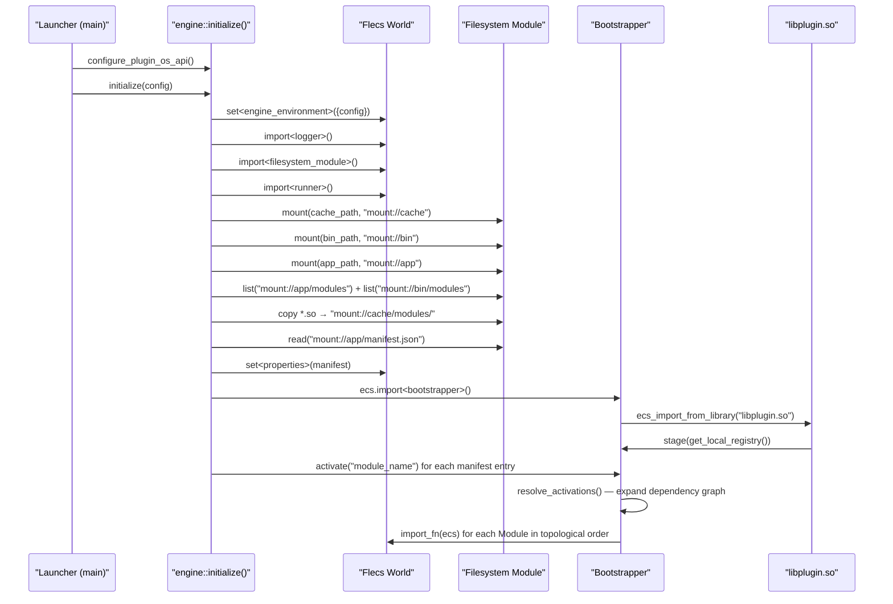
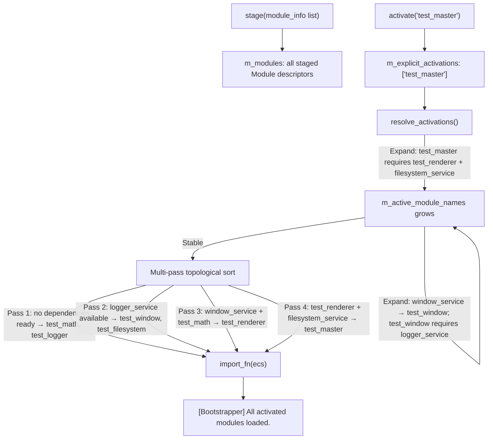
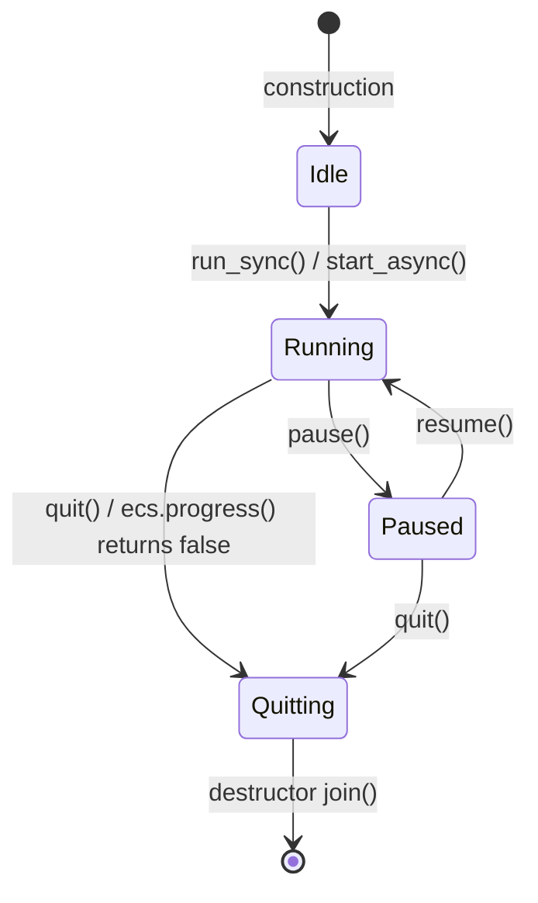

# Sandbox Engine — Developer Wiki

**Version:** 1.0 | **Standard:** C++23 | **License:** MIT

This document is the exhaustive technical reference for the Sandbox Meta-Engine. It is structured for developers integrating with the engine, building plugins, or extending the core subsystems.

---

## Table of Contents

- [I. Architectural Foundation](#i-architectural-foundation)
  - [1.1 Design Philosophy](#11-design-philosophy)
  - [1.2 The Engine Core](#12-the-engine-core)
  - [1.3 The Bootstrapper](#13-the-bootstrapper)
  - [1.4 ABI & Plugin Safety](#14-abi--plugin-safety)
- [II. Systems Reference](#ii-systems-reference)
  - [2.1 Filesystem Subsystem](#21-filesystem-subsystem)
  - [2.2 Logger Subsystem](#22-logger-subsystem)
  - [2.3 Runner Subsystem](#23-runner-subsystem)
  - [2.4 Properties Utility](#24-properties-utility)
- [III. Developer's Handbook](#iii-developers-handbook)
  - [3.1 Creating a Plugin](#31-creating-a-plugin)
  - [3.2 Declaring Modules](#32-declaring-modules)
  - [3.3 Declaring Services](#33-declaring-services)
  - [3.4 Dependency Graphing](#34-dependency-graphing)
  - [3.5 Manifest Reference](#35-manifest-reference)
  - [3.6 Engine Environment Configuration](#36-engine-environment-configuration)
- [IV. Technical Specifications](#iv-technical-specifications)
  - [4.1 Threading Model](#41-threading-model)
  - [4.2 VFS Specification](#42-vfs-specification)
  - [4.3 Event Bus Architecture](#43-event-bus-architecture)
  - [4.4 Logging Macros Reference](#44-logging-macros-reference)

---

# I. Architectural Foundation

## 1.1 Design Philosophy

Sandbox is built on two foundational principles: **Data-Driven Configuration** and **Plugin-Oriented Architecture**.

**Data-Driven Configuration** means that no engine behavior is hard-coded into the runtime binary. What modules to load, at what FPS to run, where to write cache files — all of this is determined at runtime from configuration data. The engine binary itself is agnostic to the application it runs.

**Plugin-Oriented Architecture** means that every application-level feature is a separate shared library (`.so` / `.dll`). The engine binary contains only the core subsystems (Logger, Filesystem, Runner) and the infrastructure to load, link, and orchestrate plugins. The application's modules — renderer, physics, audio, UI — are plugins that the engine discovers and imports at runtime.

The consequence of this design is strong **Separation of Concerns**:
- The engine does not know what a renderer is.
- A renderer module does not need to include engine headers to access a logger.
- Modules communicate entirely through **typed events** on the **ECS world** and **Service components**.

### Key Terminology

| Term | Definition |
|---|---|
| **Engine** | The `sandbox::engine` class. Owns the ECS world and orchestrates startup/shutdown. |
| **Module** | A C++ struct that registers itself with Flecs via `ecs.import<T>()`. The unit of functionality. |
| **Plugin** | A shared library (`.so`/`.dll`) that packages one or more Modules and exports `SandboxLibraryMain`. |
| **Service** | A named interface pointer stored as a singleton ECS component. The bridge between modules. |
| **Manifest** | A `manifest.json` file inside the application archive declaring which top-level Modules to activate. |
| **Mount** | A virtual path prefix (`mount://app`, `mount://cache`, `mount://bin`) that maps to a physical path or archive. |
| **Bootstrapper** | The engine component that resolves the Module dependency graph and imports Modules in order. |
| **Environment** | The `engine_environment` ECS entity (`::Sandbox::Environment`) holding the runtime config map. |

---

## 1.2 The Engine Core

The engine's lifecycle is managed entirely by the `sandbox::engine` class, defined in `sandbox/core/engine.h`.

```cpp
// sandbox/core/engine.h
namespace sandbox {

    struct engine_environment {
        std::unordered_map<std::string, std::any> config;
    };

    class SANDBOX_API engine {
    public:
        engine();
        ~engine(); // Calls finalize() if initialized

        // Non-copyable, moveable
        engine(const engine&) = delete;
        engine& operator=(const engine&) = delete;
        engine(engine&&) noexcept = default;
        engine& operator=(engine&&) noexcept = default;

        /// Initialize all core subsystems and load plugins from the manifest.
        /// Throws std::runtime_error on any unrecoverable failure.
        void initialize(const std::unordered_map<std::string, std::any>& config);

        /// Signals the Runner to stop and resets the ECS world.
        /// Safe to call explicitly; the destructor will not double-finalize.
        void finalize();

    public:
        flecs::world ecs; // ECS world — access subsystems via service components
    private:
        bool m_initialized{false};
    };
}
```

### Initialization Sequence

The `engine::initialize(config)` call executes the following pipeline. Each step is exception-safe: failure at any stage throws `std::runtime_error` and leaves the engine in its pre-initialized state.



### Canonical Host Pattern

```cpp
#include "sandbox/core/engine.h"
#include "sandbox/core/plugin.h"

int main(int argc, char* argv[]) {
    // 1. Configure the Flecs OS API BEFORE constructing the engine.
    //    The flecs::world member is created at engine construction time.
    sandbox::configure_plugin_os_api();
    sandbox::engine engine_instance;

    std::unordered_map<std::string, std::any> config;
    config["app_mount"]    = std::filesystem::path("/path/to/myapp.zip");
    config["dev_mode"]     = false;
    config["logger_level"] = spdlog::level::info;
    config["fps_limit"]    = 60;

    try {
        engine_instance.initialize(config);
        // Optionally enter the main loop:
        // engine_instance.ecs.get<sandbox::runner_service>().api->run_sync(engine_instance.ecs);
    } catch (const std::exception& e) {
        std::cerr << "[Launcher] Fatal: " << e.what() << '\n';
        return -1;
    }
    return 0;
}
```

> **Important:** `configure_plugin_os_api()` must be called before `sandbox::engine` is constructed. This function installs the `dlopen`/`dlsym`/`dlclose` callbacks into the Flecs OS API — which must be in place before any `ecs_import_from_library` call.

---

## 1.3 The Bootstrapper

The **Bootstrapper** (`sandbox/core/bootstrapper.h`) is the engine's dependency resolver. It is itself a Flecs module imported into the ECS world, allowing plugin code to access it via `ecs.get_mut<bootstrapper>()`.



### `bootstrapper` Public API

```cpp
namespace sandbox {

    struct SANDBOX_API bootstrapper {
        explicit bootstrapper(flecs::world& ecs);

        /// Append module descriptors from a loaded Plugin.
        void stage(const std::vector<module_info>& info);

        /// Queue a Module name for activation. Returns false if no staged Module matches.
        bool activate(const std::string& module_name);

        /// Resolve the full dependency graph and import all activated Modules in order.
        /// Throws std::runtime_error on deadlock or unsatisfied required Services.
        void execute(flecs::world& ecs);
    };
}
```

### Dependency Resolution Rules

1. **`resolve_activations()`** — expands `m_explicit_activations` into `m_active_module_names` by cascading all `require` constraints until the set stabilises.
2. **Service resolution** — if a `require`d Service is not provided by any active Module, the Bootstrapper searches staged (but not yet active) Modules for a provider satisfying the version constraint. If none is found, it throws `std::runtime_error`.
3. **Version Constraint (SemVer-lite)** — `min_major` must match exactly; `min_minor` must be ≥ the required minimum.
4. **Topological Sort** — multi-pass: in each pass, every active Module whose requirements are fully satisfied is imported. A pass with zero progress on a non-empty remaining set indicates a deadlock and throws.

---

## 1.4 ABI & Plugin Safety

A Plugin is a standard platform shared library that exports a single C-linkage function:

```c
extern "C" SANDBOX_EXPORT void SandboxLibraryMain(ecs_world_t* world);
```

Flecs uses `dlopen`/`LoadLibrary` to load the shared library and `dlsym`/`GetProcAddress` to call `SandboxLibraryMain`. The engine uses `SANDBOX_DECLARE_LIBRARY()` to generate this entry point automatically.

**ABI contract:** Plugin shared libraries are loaded in-process. They share the same Flecs world pointer. The plugin must be compiled against the same Flecs version and the same `sandbox/core/*.h` public headers as the engine. The engine exports no complex third-party template types across the DLL boundary; Services are raw interface pointers.

**`SANDBOX_API` macro** — defined in `sandbox/core/platform.h`. Expands to `__attribute__((visibility("default")))` on GCC/Clang (Linux/macOS) and `__declspec(dllexport/dllimport)` on MSVC (Windows). Use it on every symbol that crosses the DLL boundary.

---

# II. Systems Reference

## 2.1 Filesystem Subsystem

### Concept

The Filesystem subsystem provides a unified, virtualized abstraction over physical OS paths. All file access uses `mount://` virtual paths. Physical paths, archive files, and writable directories are all mapped into this virtual namespace via **Mounts**. The implementation is backed by [PhysFS](https://icculus.org/physfs/).

Modules never access `std::filesystem` directly for application assets. They use either the Service interface or the Filesystem Event Bus macros.

### Service Component

```cpp
// sandbox/subsystems/filesystem/ifilesystem.h
struct filesystem_service {
    ifilesystem* api{nullptr};
};
```

Access from any Module:
```cpp
auto& fs = ecs.get<sandbox::filesystem_service>().api;
auto result = fs->read("mount://app/config.json");
```

### `ifilesystem` Interface

```cpp
class ifilesystem {
public:
    virtual ~ifilesystem() = default;

    // Mount/Unmount physical paths or archives into the VFS
    [[nodiscard]] virtual std::expected<void, std::string>
        mount(std::string_view physical_path, std::string_view virtual_prefix, bool read_only = true) = 0;

    [[nodiscard]] virtual std::expected<void, std::string>
        unmount(std::string_view virtual_prefix) = 0;

    // File I/O
    [[nodiscard]] virtual std::expected<std::vector<std::byte>, std::string>
        read(std::string_view virtual_path) const = 0;

    [[nodiscard]] virtual std::expected<void, std::string>
        write(std::string_view virtual_path, std::vector<std::byte> data, bool append = false) = 0;

    // Directory operations
    [[nodiscard]] virtual std::expected<std::vector<std::filesystem::path>, std::string>
        list(std::string_view virtual_path, bool recursive = false) const = 0;

    [[nodiscard]] virtual std::expected<void, std::string>
        remove(std::string_view virtual_path) = 0;

    [[nodiscard]] virtual std::expected<void, std::string>
        mkdir(std::string_view virtual_path) = 0;

    // Metadata and path resolution
    [[nodiscard]] virtual std::expected<events::filesystem::file_metadata, std::string>
        state(std::string_view virtual_path) const = 0;

    [[nodiscard]] virtual std::expected<std::filesystem::path, std::string>
        absolute(std::string_view virtual_path) const = 0;

    // Path manipulation
    [[nodiscard]] virtual std::expected<void, std::string>
        rename(std::string_view old_path, std::string_view new_path) = 0;

    [[nodiscard]] virtual std::expected<void, std::string>
        copy(std::string_view src, std::string_view dest) = 0;

    [[nodiscard]] virtual std::expected<void, std::string>
        move(std::string_view src, std::string_view dest) = 0;

    // Dynamic configuration
    virtual void set_property(const std::string& key, const std::any& value) = 0;
    virtual std::any get_property(const std::string& key) const = 0;
};
```

### Event Bus Usage

Modules that cannot access the Service directly (e.g., plugins that avoid including engine headers) may interact with the Filesystem through the event bus. Two families of macros exist:

**`SANDBOX_FS_FETCH_*`** — returns a `std::function<>` closure for deferred execution:

```cpp
// Obtain a closure; execute it later
auto read_fn = SANDBOX_FS_FETCH_READ(ecs, "mount://app/config.json");
// ...at your convenience:
std::vector<std::byte> data = read_fn();
```

**`SANDBOX_FS_EXEC_*`** — publishes the event and executes immediately inline:

```cpp
// Read immediately
std::vector<std::byte> data = SANDBOX_FS_EXEC_READ(ecs, "mount://app/config.json");

// List directory
std::vector<std::filesystem::path> files = SANDBOX_FS_EXEC_LIST(ecs, "mount://app/assets", false);

// Write bytes
std::vector<std::byte> buf = ...;
SANDBOX_FS_EXEC_WRITE(ecs, "mount://cache/save.dat", buf, false);

// Create directory
SANDBOX_FS_EXEC_MKDIR(ecs, "mount://cache/saves");

// File metadata
events::filesystem::file_metadata meta = SANDBOX_FS_EXEC_STATE(ecs, "mount://app/manifest.json");

// Mount/Unmount
SANDBOX_FS_MOUNT(ecs, "/home/user/mods", "mount://mods", true);
SANDBOX_FS_UNMOUNT(ecs, "mount://mods");
```

### Filesystem Event Types (`sandbox/event_bus/filesystem_events.h`)

| Event Struct | Purpose |
|---|---|
| `events::filesystem::read_request` | Requests a file read; result stored in `result_command` closure |
| `events::filesystem::write_request` | Requests a file write with optional append |
| `events::filesystem::list_request` | Requests a directory listing (flat or recursive) |
| `events::filesystem::state_request` | Requests `file_metadata` for a virtual path |
| `events::filesystem::absolute_request` | Resolves a virtual path to its physical absolute path |
| `events::filesystem::delete_request` | Requests file deletion |
| `events::filesystem::mkdir_request` | Requests directory creation |
| `events::filesystem::rename_request` | Requests path rename |
| `events::filesystem::copy_request` | Requests file copy |
| `events::filesystem::move_request` | Requests file move (copy + delete) |
| `events::filesystem::mount_path` | Adds a new Mount to the VFS |
| `events::filesystem::unmount_path` | Removes a Mount from the VFS |

### Filesystem Exception Hierarchy

All synchronous filesystem errors derive from `events::filesystem::filesystem_error`:

```
filesystem_error
├── filesystem_mount_error       — Mount/unmount failure
├── filesystem_not_found_error   — Path does not exist
├── filesystem_read_error        — Read failure
├── filesystem_write_error       — Write failure
└── filesystem_system_error      — OS-level error
```

### Configuration Keys

| Key | Type | Default | Description |
|---|---|---|---|
| *(none currently)* | — | — | Filesystem reads its mount paths from the engine at startup; no user-configurable keys. |

---

## 2.2 Logger Subsystem

### Concept

The Logger subsystem provides a structured, level-gated logging interface backed by [spdlog](https://github.com/gabime/spdlog). All engine-internal logging goes through the macros defined in `sandbox/event_bus/logger_events.h`. These macros publish `events::log` events to the ECS world, which the Logger Module intercepts.

A "boot logger" is created during `ecs.import<logger>()`, before the Manifest is loaded or any plugin boots, ensuring that early startup messages are captured.

### Service Component

```cpp
// sandbox/subsystems/logger/ilogger.h
struct logger_service {
    ilogger* api{nullptr};
};
```

### `ilogger` Interface

```cpp
class ilogger {
public:
    virtual ~ilogger() = default;

    [[nodiscard]] virtual std::expected<void, std::string>
        log(const events::log& log_event) = 0;

    // Dynamic property access
    virtual void set_property(const std::string& key, const std::any& value) = 0;
    virtual std::any get_property(const std::string& key) const = 0;
};
```

### Event Bus Usage

Use the logging macros exclusively. Do not call `ilogger::log()` directly from plugin code.

```cpp
#include "sandbox/event_bus/logger_events.h"

// Standard levels (level gated by dev_mode / logger_level config)
SANDBOX_TRACE(ecs, "Detailed trace: value={}", some_value);  // Debug builds only
SANDBOX_DEBUG(ecs, "Debug value: {}", x);                    // Debug builds only
SANDBOX_INFO (ecs, "[MyModule] Initialization complete.");
SANDBOX_WARN (ecs, "[MyModule] Config key '{}' missing, using default.", key);
SANDBOX_ERROR(ecs, "[MyModule] Failed to open file: {}", path.string());
SANDBOX_FATAL(ecs, "[MyModule] Unrecoverable state.");

// Force-throw variants (ignore logger_level, always emit + return std::unexpected)
SANDBOX_WARN_THROW (ecs, "[MyModule] ...");
SANDBOX_ERROR_THROW(ecs, "[MyModule] ...");
SANDBOX_FATAL_THROW(ecs, "[MyModule] ...");
```

`SANDBOX_TRACE` and `SANDBOX_DEBUG` expand to `(void)0` in Release builds (`#ifndef NDEBUG`).

### `events::log` Structure

```cpp
namespace sandbox::events {
    struct log {
        enum class level { Trace, Debug, Info, Warn, Error, Fatal };

        std::string message;
        level log_level;
        const char* source_file;
        int source_line;
        std::optional<bool> throw_on_error_override;
    };
}
```

The `throw_on_error_override` field controls whether the logger returns `std::unexpected` after emitting:
- `std::nullopt` — defer to the `throw_on_error` configuration key.
- `true` — always return `std::unexpected`.
- `false` — never throw, even on Error/Fatal.

### Configuration Keys

| Key | Type | Default | Description |
|---|---|---|---|
| `logger_level` | `spdlog::level::level_enum` | `spdlog::level::info` | Minimum log level to emit |
| `logger_name` | `std::string` | `"sandbox_core"` | Internal spdlog logger name |
| `throw_on_error` | `bool` | `false` | Whether Error/Fatal messages return `std::unexpected` |
| `dev_mode` | `bool` | `false` | If true, overrides `logger_level` to `trace` |
| `enable_async` | `bool` | `true` | Reserved for future async sink support |

### Dynamic Level Update

Use `set_property` on the logger Service to update the log level at runtime:

```cpp
auto* log_api = ecs.get<sandbox::logger_service>().api;
log_api->set_property("logger_level", spdlog::level::warn);
```

The change takes effect on the next `log()` call. Invalid types are rejected with a warning; the level is not modified.

---

## 2.3 Runner Subsystem

### Concept

The Runner subsystem manages the engine's main execution loop. It supports both **synchronous** (blocking the calling thread) and **asynchronous** (a dedicated worker thread) execution modes. The loop progresses the Flecs ECS pipeline on each tick and respects a configurable FPS target.

### Service Component

```cpp
// sandbox/subsystems/runner/irunner.h
struct runner_service {
    irunner* api{nullptr};
};
```

### `irunner` Interface

```cpp
class irunner {
public:
    virtual ~irunner() = default;

    /// Block the calling thread and run the tick loop until quit() is called.
    virtual void run_sync(flecs::world& ecs) = 0;

    /// Spawn a dedicated worker thread and return immediately.
    virtual void start_async(flecs::world& ecs) = 0;

    /// Signal the loop to exit. Safe to call from any thread.
    virtual void quit() = 0;

    /// Pause the loop. The worker thread blocks on the condition variable.
    virtual void pause() = 0;

    /// Resume a paused loop.
    virtual void resume() = 0;

    // Dynamic property access
    virtual void set_property(const std::string& key, const std::any& value) = 0;
    virtual std::any get_property(const std::string& key) const = 0;
};
```

### Event Bus Usage

The Runner listens for `events::runner::state_change` to allow decoupled state control:

```cpp
#include "sandbox/event_bus/runner_events.h"

// Quit the loop from within a system
sandbox::events::publish(ecs, sandbox::events::runner::state_change{
    sandbox::events::runner::state_change::action::Quit
});

// Pause
sandbox::events::publish(ecs, sandbox::events::runner::state_change{
    sandbox::events::runner::state_change::action::Pause
});

// Resume
sandbox::events::publish(ecs, sandbox::events::runner::state_change{
    sandbox::events::runner::state_change::action::Resume
});
```

Alternatively, access the Service directly for synchronous control:

```cpp
auto* runner = ecs.get<sandbox::runner_service>().api;
runner->run_sync(ecs);  // Blocks until quit() is called
```

### Configuration Keys

| Key | Type | Default | Description |
|---|---|---|---|
| `fps_limit` | `int` | `60` | Target frames per second for `ecs.set_target_fps()` |

Dynamic update:
```cpp
auto* runner = ecs.get<sandbox::runner_service>().api;
runner->set_property("fps_limit", 120);
```

> **Note:** The FPS is applied once at the start of `internal_tick_loop`. Dynamic updates to `m_fps_limit` take effect on the next loop start (i.e., after `quit()` + `run_sync()`). In-flight loop FPS changes require an additional `ecs.set_target_fps()` call from within an ECS system.

---

## 2.4 Properties Utility

### Concept

`sandbox::properties` is a JSON document wrapper backed by [Glaze](https://github.com/stephenberry/glaze). It provides a typed, path-based API for structured configuration data. The engine stores the application Manifest as a `properties` component on the `::Manifest` ECS entity.

### Public API

```cpp
namespace sandbox {

class SANDBOX_API properties {
public:
    using key_path = std::vector<std::string>;
    using key_list = std::vector<std::string>;
    using visitor_callback = std::function<void(const key_path& path, const std::string& json_value)>;

    // Constructors — parse JSON on construction
    properties(std::string_view json_string);
    properties(const std::vector<std::byte>& byte_data);
    properties() = default;

    // Parsing
    [[nodiscard]] static std::expected<properties, std::string> parse(std::string_view json_string);
    [[nodiscard]] static std::expected<properties, std::string> parse(const std::vector<std::byte>& byte_data);

    // Serialization
    std::string save_to_string(const key_path& path = {}) const;

    // Typed access
    template<typename T>
    [[nodiscard]] std::expected<T, std::string> get(const key_path& path) const;

    template<typename T>
    void set(const key_path& path, const T& value);

    // Structural operations
    void merge(const properties& other);
    [[nodiscard]] std::expected<void, std::string> move(const key_path& src, const key_path& dest);
    [[nodiscard]] std::expected<void, std::string> rename(const key_path& path, const std::string& new_name);
    [[nodiscard]] std::expected<void, std::string> remove(const key_path& path);
    void clear() noexcept;

    // Inspection
    bool contains(const key_path& path) const;
    [[nodiscard]] std::expected<properties, std::string> get_subtree(const key_path& path) const;
    key_list list_keys(const key_path& path = {}) const;
    void traverse(const visitor_callback& callback) const;
};

}
```

### Usage Example

```cpp
// Reading the manifest from the ECS world
auto& manifest = ecs.entity("::Manifest").get<sandbox::properties>();

// Get a typed value at a JSON path
auto modules = manifest.get<std::vector<std::string>>({"modules"});
if (modules) {
    for (const auto& name : *modules) { /* ... */ }
}

// Get a nested value
auto timeout = manifest.get<int>({"config", "network", "timeout_ms"});
int ms = timeout.value_or(5000);

// Modifying (on a mutable properties instance)
props.set({"config", "max_fps"}, 144);
props.remove({"debug", "verbose"});
```

---

# III. Developer's Handbook

## 3.1 Creating a Plugin

A Plugin is a shared library that packages one or more Modules. The complete structure is:

```
myplugin/
├── CMakeLists.txt
└── source/
    └── myplugin.cpp
```

**`CMakeLists.txt`:**
```cmake
add_library(myplugin MODULE source/myplugin.cpp)

target_link_libraries(myplugin PRIVATE sandbox)
target_include_directories(myplugin PRIVATE ${sandbox_INCLUDE_DIRS})

# Place the .so in the modules directory so the engine can discover it
set_target_properties(myplugin PROPERTIES
    LIBRARY_OUTPUT_DIRECTORY "${CMAKE_BINARY_DIR}/bin/modules"
    PREFIX ""
)
```

**`source/myplugin.cpp` — Minimal "Hello World" Plugin:**
```cpp
#include "sandbox/core/plugin.h"   // SANDBOX_DECLARE_MODULE, SANDBOX_DECLARE_LIBRARY
#include "sandbox/core/service.h"  // SANDBOX_DECLARE_SERVICE

// ============================================================================
// Step 1: Declare any Services this Plugin produces or consumes
// ============================================================================

struct i_my_interface {};  // The abstract interface struct

SANDBOX_DECLARE_SERVICE(my_service, i_my_interface)

// ============================================================================
// Step 2: Define your Module
// ============================================================================

struct hello_module {
    hello_module(flecs::world& ecs) {
        // Register this module as the provider of my_service
        ecs.set<my_service>({nullptr, 1, 0});

        // Use the ECS-routed logger
        // (requires logger_service to already be loaded — declare it as a requirement below)
        SANDBOX_INFO(ecs, "[Hello] Module booted.");
    }
};

// ============================================================================
// Step 3: Register the Module with the Bootstrapper
// ============================================================================

SANDBOX_DECLARE_MODULE(
    hello_module,              // C++ struct name
    hello_world,               // Module name (used in manifest.json and requirements)
    1,                         // Version major
    0,                         // Version minor
    "my_service",              // Service this Module provides (empty string if none)
    // Requirements:
    {sandbox::requirement::kind::service, sandbox::requirement::strictness::require, "logger_service", 1, 0}
);

// ============================================================================
// Step 4: Export the Plugin entry point
// ============================================================================

SANDBOX_DECLARE_LIBRARY()
```

**`manifest.json`** (inside the application `.zip`):
```json
{
    "modules": [
        "hello_world"
    ]
}
```

When the engine boots with this archive, it will automatically discover `libmyplugin.so`, load `hello_module` via the Bootstrapper (after `logger_service` is available), and emit `[Hello] Module booted.`

---

## 3.2 Declaring Modules

`SANDBOX_DECLARE_MODULE` generates a static inline initializer that registers a `module_info` descriptor into the per-library registry (`get_local_registry()`).

```cpp
#define SANDBOX_DECLARE_MODULE(Class, Name, Major, Minor, Service, ...)
```

| Parameter | Type | Description |
|---|---|---|
| `Class` | C++ struct | The Module struct. Must have a constructor `(flecs::world& ecs)`. |
| `Name` | identifier | The Module's string name (stringified with `#`). Used in `manifest.json` and `requirement::target_name`. |
| `Major` | integer | Semantic version major. |
| `Minor` | integer | Semantic version minor. |
| `Service` | string literal | The Service name this Module provides. Use `""` if none. |
| `...` | `requirement{}` | Zero or more `sandbox::requirement` initializer-list entries (variadic). |

The macro generates a `static inline bool` initialized by an immediately-invoked lambda, which runs at static initialization time. The Module struct is captured in a `create_module_info<Class>()` call that stores a typed `import_fn` lambda.

---

## 3.3 Declaring Services

A **Service** is a singleton ECS component that exposes an abstract interface pointer. It is the canonical mechanism for inter-module communication.

```cpp
#define SANDBOX_DECLARE_SERVICE(service_name, interface_type)
// Expands to:
struct service_name {
    static constexpr const char* type_name = "service_name";
    interface_type* api{nullptr};
    uint8_t version_major{1};
    uint8_t version_minor{0};
};
```

**Producing a Service** (in your Module constructor):
```cpp
// Implement the interface
struct my_logger_impl : public i_logger_interface {
    void log(const std::string& msg) override { /* ... */ }
};

struct my_logger_module {
    my_logger_module(flecs::world& ecs) {
        m_impl = std::make_unique<my_logger_impl>();
        ecs.set<my_logger_service>({m_impl.get(), 1, 0});
    }
private:
    std::unique_ptr<my_logger_impl> m_impl;
};
```

**Consuming a Service** (in any Module loaded after the provider):
```cpp
struct my_renderer_module {
    my_renderer_module(flecs::world& ecs) {
        auto& logger = ecs.get<my_logger_service>().api;
        logger->log("Renderer booted.");
    }
};
```

The Bootstrapper guarantees that `my_logger_service` is loaded before `my_renderer_module` if `my_renderer_module` declares the appropriate requirement.

---

## 3.4 Dependency Graphing

Dependencies are declared per-Module using `sandbox::requirement`:

```cpp
struct requirement {
    enum class kind       { service, module };   // What is the target?
    enum class strictness { require, expect };   // Is it mandatory?

    kind        target_kind;
    strictness  policy;
    std::string target_name;
    uint8_t     min_major{1};
    uint8_t     min_minor{0};
};
```

| `kind` | `target_name` matches | Bootstrapper searches for... |
|---|---|---|
| `service` | A Service name (e.g., `"window_service"`) | A Module in `m_modules` where `provides_service == target_name` |
| `module` | A Module name (e.g., `"test_math"`) | A Module in `m_modules` where `name == target_name` |

| `strictness` | Behavior |
|---|---|
| `require` | The target must be loaded before this Module can import. Resolution throws if unresolvable. |
| `expect` | Optional. The Bootstrapper activates the target if available, but does not fail if absent. |

**Example — complex dependency graph:**
```cpp
// A: Depends on services B and C; B and C each depend on service Logger
SANDBOX_DECLARE_MODULE(
    module_a_struct, module_a, 1, 0, "",
    {sandbox::requirement::kind::service, sandbox::requirement::strictness::require, "service_b", 1, 0},
    {sandbox::requirement::kind::service, sandbox::requirement::strictness::require, "service_c", 1, 0}
);

SANDBOX_DECLARE_MODULE(
    module_b_struct, module_b, 1, 0, "service_b",
    {sandbox::requirement::kind::service, sandbox::requirement::strictness::require, "logger_service", 1, 0}
);

SANDBOX_DECLARE_MODULE(
    module_c_struct, module_c, 1, 0, "service_c",
    {sandbox::requirement::kind::service, sandbox::requirement::strictness::require, "logger_service", 1, 0}
);

SANDBOX_DECLARE_MODULE(module_logger_struct, module_logger, 1, 0, "logger_service");
```

Boot order resolved by the Bootstrapper:
1. `module_logger` (no deps)
2. `module_b` and `module_c` (in any order, both need only `logger_service`)
3. `module_a` (needs both `service_b` and `service_c`)

---

## 3.5 Manifest Reference

The **Manifest** is a `manifest.json` file located at the root of the application archive (`mount://app/manifest.json`). The engine reads it during `initialize()` and stores it as a `sandbox::properties` component on the `::Manifest` entity.

### Schema

```json
{
    "modules": [
        "module_name_1",
        "module_name_2"
    ]
}
```

| Field | Type | Required | Description |
|---|---|---|---|
| `modules` | `string[]` | Yes | Array of Module names to activate. Each must match a `SANDBOX_DECLARE_MODULE` `Name` parameter in a staged Plugin. |

The engine calls `bootstrapper::activate(name)` for each entry. If a name does not match any staged Module, the engine logs a warning and continues (it does not fail).

### Extending the Manifest

The `properties` API allows reading arbitrary keys:

```cpp
auto& manifest = ecs.entity("::Manifest").get<sandbox::properties>();

// Custom application-defined config
auto window_title = manifest.get<std::string>({"app", "window", "title"});
auto max_entities = manifest.get<int>({"config", "max_entities"}).value_or(10000);
```

Extended manifest example:
```json
{
    "modules": ["game_master"],
    "app": {
        "window": {
            "title": "My Game",
            "width": 1920,
            "height": 1080
        }
    },
    "config": {
        "max_entities": 50000
    }
}
```

---

## 3.6 Engine Environment Configuration

All engine and subsystem configuration is passed to `engine::initialize()` as a `std::unordered_map<std::string, std::any>`. This map is stored in the ECS world as `engine_environment` on the `::Sandbox::Environment` entity and is available to all subsystem constructors.

### Reading Configuration in a Subsystem

Use `get_config<T>()` from `sandbox/utilities/config_helper.h`:

```cpp
#include "sandbox/utilities/config_helper.h"

auto env_entity = ecs.entity("::Sandbox::Environment");
std::unordered_map<std::string, std::any> config;
if (env_entity.has<engine_environment>()) {
    config = env_entity.get<engine_environment>().config;
}

// Safe extraction with type check and fallback
int fps = sandbox::get_config<int>(config, "fps_limit", 60);
bool dev = sandbox::get_config<bool>(config, "dev_mode", false);
auto level = sandbox::get_config<spdlog::level::level_enum>(
    config, "logger_level", spdlog::level::info);
```

`get_config<T>` returns the `default_value` if the key is absent or the stored `std::any` does not hold type `T`. It never throws.

### Full Configuration Reference

| Key | Type | Used By | Default | Description |
|---|---|---|---|---|
| `app_mount` | `std::filesystem::path` | Engine | *(required)* | Path to application archive or directory |
| `dev_mode` | `bool` | Logger | `false` | Overrides `logger_level` to `trace` |
| `logger_level` | `spdlog::level::level_enum` | Logger | `spdlog::level::info` | Minimum spdlog emit level |
| `logger_name` | `std::string` | Logger | `"sandbox_core"` | Internal spdlog logger instance name |
| `throw_on_error` | `bool` | Logger | `false` | Whether Error/Fatal return `std::unexpected` |
| `enable_async` | `bool` | Logger | `true` | Reserved for async sink support |
| `fps_limit` | `int` | Runner | `60` | Target frames per second |
| `module_args` | `unordered_map<string,string>` | Engine | `{}` | Arbitrary key-value pairs passed to modules |

---

# IV. Technical Specifications

## 4.1 Threading Model

The Runner operates in one of two modes, selected by the host:

### Synchronous Mode (`run_sync`)

`run_sync(ecs)` blocks the calling thread. The tick loop runs on the thread that invoked it. This is the standard mode for single-threaded game loops.

```
Main Thread:
  engine::initialize() → load plugins →
  runner::run_sync(ecs) → [tick] → [tick] → ... → quit() →
  engine::finalize()
```

### Asynchronous Mode (`start_async`)

`start_async(ecs)` spawns a `std::thread` (`m_worker_thread`) and returns immediately. The tick loop runs on the worker thread. The host may proceed with other work (e.g., processing OS events on the main thread).

```
Main Thread:           start_async() → ... OS event loop ... → quit()
Worker Thread:         [tick] → [tick] → [tick] → quit signal → join()
```

### State Machine

The Runner maintains an internal `execution_state` enum guarded by `m_state_mutex`:



### Thread Safety Guarantees

- `quit()`, `pause()`, and `resume()` are safe to call from any thread. Each acquires `m_state_mutex` before mutating state.
- `start_async()` checks `m_state == Idle` under the lock before spawning the thread. Calling `start_async()` on an already-running runner is a no-op.
- The destructor calls `quit()` and then `m_worker_thread.join()`, ensuring clean shutdown.
- `internal_tick_loop` uses `std::unique_lock` + `m_state_cv.wait()` to block on `Paused` state without busy-waiting.

### Condition Variable Protocol

The worker thread waits on `m_state_cv` with the predicate:
```cpp
m_state == execution_state::Running || m_state == execution_state::Quitting
```

`pause()` transitions state to `Paused` without notifying the CV, causing the worker to block on its next wait. `resume()` and `quit()` both call `m_state_cv.notify_all()` to wake the worker.

---

## 4.2 VFS Specification

The Virtual Filesystem maps every file access through a unified `mount://` scheme. All paths passed to `ifilesystem` methods must use forward slashes and the `mount://` prefix.

### Standard Mount Points

The engine establishes three Mounts during `initialize()`:

| Mount Prefix | Physical Location | Writable | Description |
|---|---|---|---|
| `mount://cache` | OS user data directory | ✅ Yes | Writable output: saved modules, save files, generated content |
| `mount://bin` | Executable directory | ❌ No | Engine binaries and bundled modules |
| `mount://app` | Application archive path | ❌ No | Application assets, manifest, packaged modules |

The user data directory is resolved by `sandbox::filesystem::get_user_data_directory()`, which returns the platform-appropriate location (e.g., `~/.local/share/sandbox/` on Linux).

### Module Discovery Flow

```
1. fs->list("mount://app/modules")  → collect .so paths from app archive
2. fs->list("mount://bin/modules")  → collect .so paths from binary directory
3. fs->mkdir("mount://cache/modules")
4. fs->copy(each .so → "mount://cache/modules/")
5. ecs_import_from_library(resolved physical path in cache)
```

The copy-to-cache step is required because PhysFS cannot `dlopen` files inside a `.zip` archive. The cache provides a writable, physical-path-accessible directory.

### Path Resolution Rules

- **Read operations** (`read`, `list`, `state`, `absolute`) resolve through all mounted read paths in the order they were mounted.
- **Write operations** (`write`, `mkdir`, `remove`, `rename`, `copy dest`) resolve exclusively to the first writable mount whose prefix matches.
- Path traversal protection: `resolve_physical_write_path()` validates that the resolved path does not escape the mount root.

### Custom Mounts (from Plugins)

Plugins may add their own Mounts after the engine has initialized:

```cpp
// In your module constructor — add a mod directory as a read-only mount
SANDBOX_FS_MOUNT(ecs, "/home/user/.local/share/mygame/mods", "mount://mods", true);

// Read from it
auto data = SANDBOX_FS_EXEC_READ(ecs, "mount://mods/overrides/config.json");

// Unmount when done
SANDBOX_FS_UNMOUNT(ecs, "mount://mods");
```

---

## 4.3 Event Bus Architecture

The Event Bus (`sandbox/event_bus/event_bus.h`) provides a type-safe, ECS-integrated publish/subscribe system. Events are Flecs component types published to the ECS world.

### Core API

```cpp
namespace sandbox::events {

    // Synchronous: published and handled immediately
    template<typename EventType>
    void publish(flecs::world world, const EventType& payload,
                 flecs::entity channel = flecs::entity());

    // Asynchronous: queued for next ECS pipeline tick
    template<typename EventType>
    void publish_async(flecs::world world, EventType payload,
                       flecs::entity channel = flecs::entity());

    // Subscribe: returns a Flecs entity (the observer). Destroy it to unsubscribe.
    template<typename EventType, typename Func>
    flecs::entity subscribe(flecs::world world, Func&& callback,
                            flecs::entity channel = flecs::entity());
}
```

### Event Types by Subsystem

| Namespace | Event | Direction |
|---|---|---|
| `events::log` | Log message emission | Module → Logger |
| `events::filesystem::read_request` | File read | Module → Filesystem |
| `events::filesystem::write_request` | File write | Module → Filesystem |
| `events::filesystem::list_request` | Directory list | Module → Filesystem |
| `events::filesystem::state_request` | File metadata query | Module → Filesystem |
| `events::filesystem::absolute_request` | Virtual-to-physical path | Module → Filesystem |
| `events::filesystem::delete_request` | File deletion | Module → Filesystem |
| `events::filesystem::mkdir_request` | Directory creation | Module → Filesystem |
| `events::filesystem::rename_request` | Path rename | Module → Filesystem |
| `events::filesystem::copy_request` | File copy | Module → Filesystem |
| `events::filesystem::move_request` | File move | Module → Filesystem |
| `events::filesystem::mount_path` | Add VFS Mount | Module → Filesystem |
| `events::filesystem::unmount_path` | Remove VFS Mount | Module → Filesystem |
| `events::runner::state_change` | Runner control | Module → Runner |

### Custom Event Pattern

Define and use your own event types:
```cpp
// Define
namespace myapp::events {
    struct enemy_spawned {
        int enemy_id;
        float x, y, z;
    };
}

// Publish (from a spawner system)
sandbox::events::publish(ecs, myapp::events::enemy_spawned{42, 10.f, 0.f, 5.f});

// Subscribe (in your AI module constructor)
sandbox::events::subscribe<myapp::events::enemy_spawned>(ecs,
    [](const myapp::events::enemy_spawned& ev) {
        // React to spawn
    });
```

---

## 4.4 Logging Macros Reference

All macros defined in `sandbox/event_bus/logger_events.h`. The first argument is always a `flecs::world&`.

| Macro | Level | Debug-only | Throw on Error |
|---|---|---|---|
| `SANDBOX_TRACE(ecs, fmt, ...)` | Trace | ✅ | No |
| `SANDBOX_DEBUG(ecs, fmt, ...)` | Debug | ✅ | No |
| `SANDBOX_INFO(ecs, fmt, ...)`  | Info  | ❌ | No |
| `SANDBOX_WARN(ecs, fmt, ...)`  | Warn  | ❌ | No |
| `SANDBOX_ERROR(ecs, fmt, ...)` | Error | ❌ | No (honors config) |
| `SANDBOX_FATAL(ecs, fmt, ...)` | Fatal | ❌ | No (honors config) |
| `SANDBOX_WARN_THROW(ecs, fmt, ...)` | Warn | ❌ | Always |
| `SANDBOX_ERROR_THROW(ecs, fmt, ...)` | Error | ❌ | Always |
| `SANDBOX_FATAL_THROW(ecs, fmt, ...)` | Fatal | ❌ | Always |

All macros accept `std::format`-style format strings with arbitrary typed arguments:
```cpp
SANDBOX_INFO(ecs, "[{}] Loaded {} entities in {:.2f}ms.", module_name, count, duration_ms);
```

The `_THROW` variants bypass the `throw_on_error` configuration key and always cause `ilogger::log()` to return `std::unexpected(message)`. The engine propagates this as an exception in critical paths.

All macros are guarded: if `logger_service` is not yet present in the world (`!world.has<sandbox::logger_service>()`), the publish call is silently skipped.
